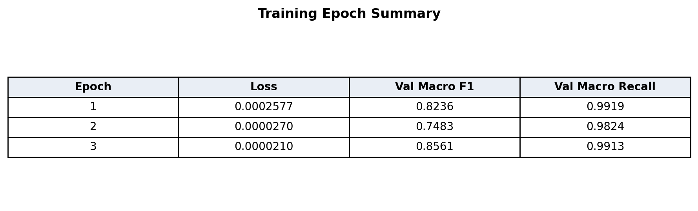
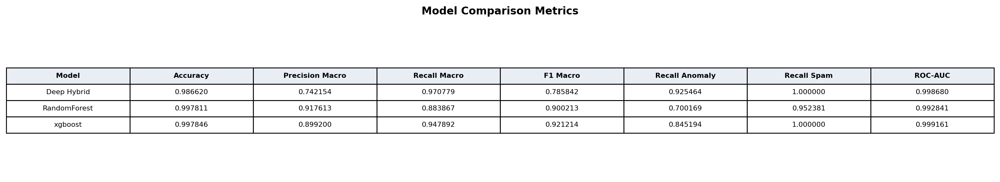
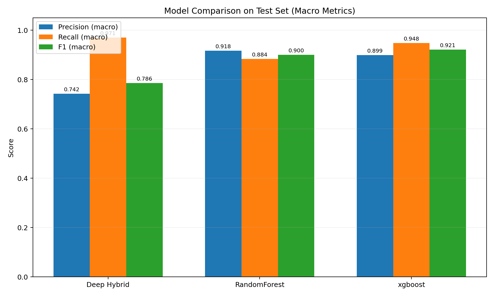
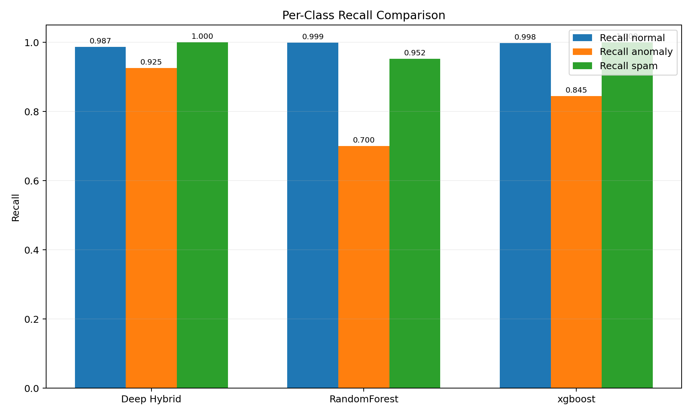
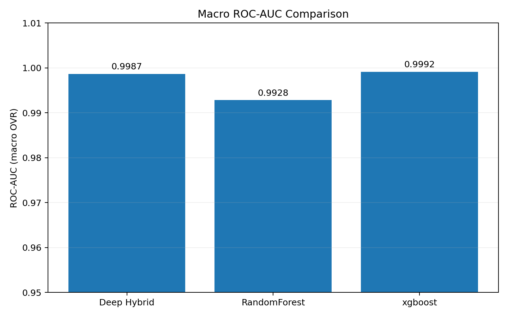
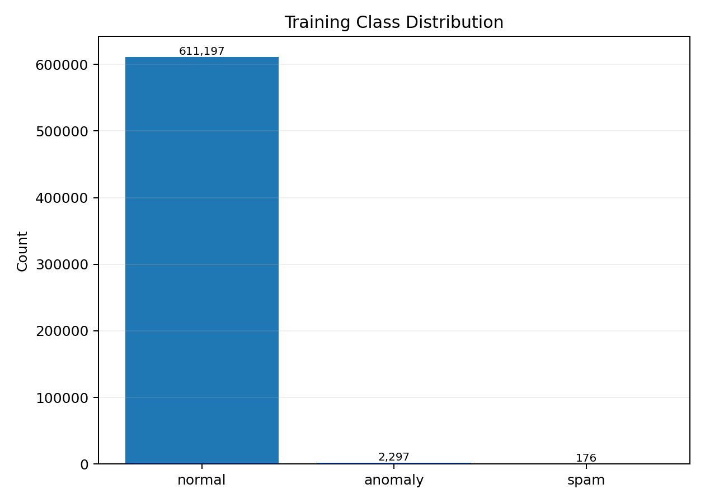
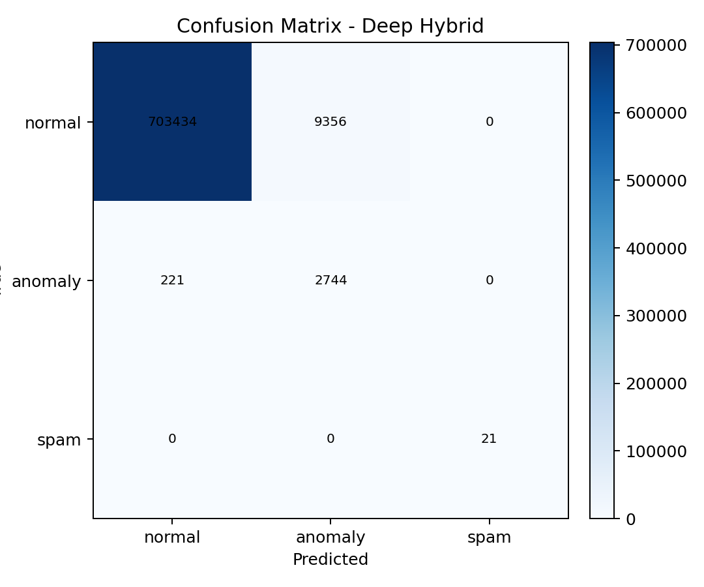
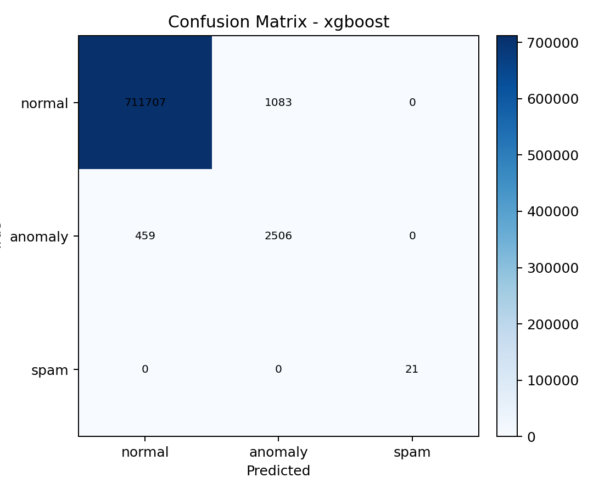

# Tez Icin Sekil Metinleri ve Aciklama Metni (Final)

Bu dokuman, uretilen performans grafiklerini tez metnine yerlestirirken kullanilacak ornek sekil aciklamalarini ve kisa yorumlarini icerir.

Public gorseller:
- Grafikler: `docs/figures/`
- Tablolar: `docs/tables/`

## Tablo 1 - Egitim Epoch Ozet Tablosu
Dosya: `tables/table_training_epoch_summary.png`

Onerilen aciklama:
"Tablo 1, egitim surecinde her epoch icin loss, validation macro F1 ve validation macro recall degerlerini gostermektedir."

## Tablo 2 - Model Karsilastirma Metrikleri
Dosya: `tables/table_model_comparison_metrics.png`

Onerilen aciklama:
"Tablo 2, onerilen derin ogrenme tabanli hibrit model ile klasik baseline modellerin accuracy, macro precision, macro recall, macro F1, anomaly recall, spam recall ve ROC-AUC degerlerini birlikte sunmaktadir."

## Sekil 1 - Model Bazli Makro Metrik Karsilastirmasi
Dosya: `figures/fig_macro_metrics.png`

Onerilen aciklama:
"Sekil 1'de test veri bolumunde Deep Hybrid, RandomForest ve XGBoost modellerinin makro precision, makro recall ve makro F1 degerleri karsilastirilmistir. Onerilen derin ogrenme tabanli hibrit modelin makro recall performansi daha yuksek olup tehdit kacirmama hedefi acisindan avantaj saglamaktadir."

## Sekil 2 - Sinif Bazli Recall Karsilastirmasi
Dosya: `figures/fig_per_class_recall.png`

Onerilen aciklama:
"Sekil 2, modellerin normal, anomaly ve spam siniflari icin recall degerlerini gostermektedir. Onerilen hibrit model anomaly sinifinda daha yuksek yakalama oranina ulasmistir."

## Sekil 3 - Makro ROC-AUC Karsilastirmasi
Dosya: `figures/fig_roc_auc_macro.png`

Onerilen aciklama:
"Sekil 3'te modellerin macro OVR ROC-AUC degerleri verilmistir. Tum modeller yuksek ayristirma gucu gostermektedir; model seciminde operasyonel hedefler dogrultusunda recall odagi korunmustur."

## Sekil 4 - Egitim Sinif Dagilimi
Dosya: `figures/fig_train_class_distribution.png`

Onerilen aciklama:
"Sekil 4, egitim verisindeki sinif dengesizligini gostermektedir. Ozellikle anomaly ve spam siniflarinin azinlikta olmasi, model degerlendirmesinde makro metriklerin ve sinif bazli recall analizinin onemini artirmistir."

## Sekil 5 - Deep Hybrid Confusion Matrix
Dosya: `figures/fig_confusion_deep.png`

Onerilen aciklama:
"Sekil 5'te onerilen modelin confusion matrix'i gosterilmektedir. Spam sinifinda yuksek tespit basarisi elde edilirken, anomaly sinifinda yuksek recall degeri korunmustur."

## Sekil 6 - RandomForest Confusion Matrix
Dosya: `figures/fig_confusion_random_forest.png`

## Sekil 7 - XGBoost Confusion Matrix
Dosya: `figures/fig_confusion_xgboost.png`

Onerilen aciklama:
"Sekil 6 ve Sekil 7, klasik baseline modellerin hata dagilimlarini gostermektedir. Bu karsilastirma, tezde onerilen derin ogrenme tabanli hibrit modelin operasyonel hedeflerle (ozellikle anomaly yakalama) uyumunu tartismak icin kullanilmistir."

